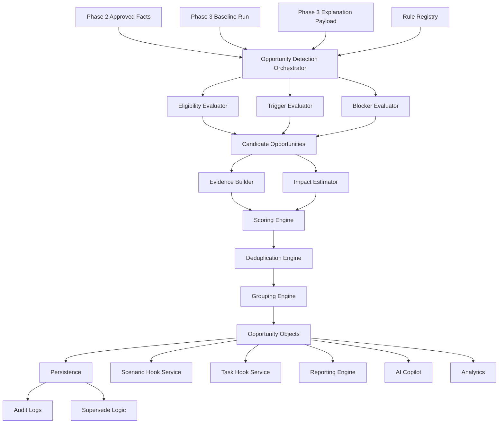
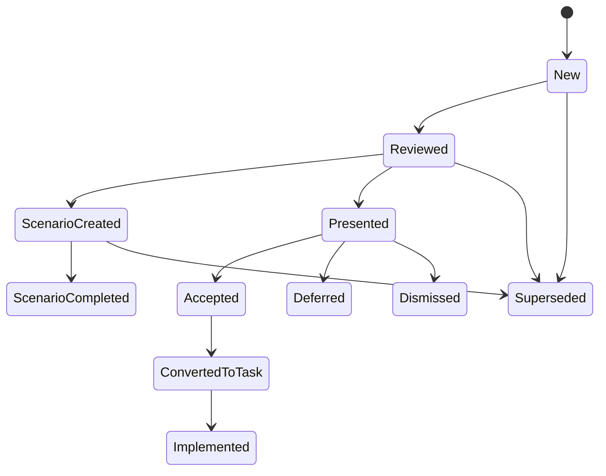

# Phase 4 Technical Build Pack — Opportunity Detection Engine
## Advisor Tax Intelligence Platform
**Audience:** AI coding team, backend engineers, product engineers, platform architects, data engineers, design systems team, QA engineers, analytics team, compliance reviewers  
**Goal:** Translate the Phase 4 PRD into an implementation-ready technical specification for the Opportunity Detection Engine so the team can build a connected, auditable, scalable recommendation layer on top of the deterministic tax engine.

---

# 1) Build Pack Purpose

This document turns the Opportunity Detection Engine PRD into an implementation-ready build pack.

Its job is to prevent the most common failure modes:
- recommendation logic scattered across multiple services
- alerts generated without evidence
- AI inventing opportunities that deterministic logic did not support
- duplicate and overlapping opportunities flooding the UI
- stale opportunities remaining active after upstream facts change
- scoring that cannot be explained
- reporting, AI, and workflow systems each creating their own recommendation objects
- lack of auditability around why an opportunity surfaced

This build pack assumes:
- Phase 2 provides approved facts and a stable household fact layer
- Phase 3 provides deterministic baseline and scenario-ready tax outputs
- Phase 4 is responsible for turning facts + computed outputs into recommendation objects
- downstream systems must consume Phase 4 outputs instead of re-deriving opportunities themselves

---

# 2) Product Boundary

## Phase 4 owns
- opportunity rule registry
- opportunity detection orchestration
- recommendation object generation
- opportunity evidence bundles
- scoring and ranking
- deduplication and grouping
- missing-data and blocker logic
- lifecycle state management
- scenario/task hooks
- persistence and audit trail
- detection events
- supersede logic

## Phase 4 does not own
- OCR and fact extraction
- deterministic tax calculation
- full scenario workspace UI
- full task/workflow engine
- final document rendering
- client portal
- unrestricted AI recommendation generation

---

# 3) System Overview

The Opportunity Detection Engine should be built as a connected set of services and libraries.

## Core domains
1. **Detection Orchestrator**
2. **Opportunity Rule Registry**
3. **Eligibility and Trigger Evaluator**
4. **Blocker / Missing Data Evaluator**
5. **Evidence Builder**
6. **Impact Estimator**
7. **Scoring and Ranking Engine**
8. **Deduplication / Merge Engine**
9. **Grouping / Presentation Payload Builder**
10. **Lifecycle / Persistence Layer**
11. **Event Emission Layer**

---

# 4) High-Level Architecture



---

# 5) Recommended Repository / Codebase Layout

```text
tax-platform/
  services/
    opportunity-engine-api/
      src/
        controllers/
        handlers/
        routes/
        auth/
    opportunity-engine-worker/
      src/
        jobs/
        orchestrators/
        evaluators/
        emitters/
    opportunity-rule-registry/
      packages/
        federal/
          2025/
          2026/
      tooling/
        validators/
        simulators/
        changelog/
    opportunity-admin-service/
      src/
        rule-toggles/
        firm-overrides/
  libs/
    domain-models/
      opportunity/
      opportunity-evidence/
      opportunity-score/
      opportunity-rule/
      opportunity-events/
      opportunity-actions/
      opportunity-grouping/
    evaluators/
      eligibility/
      trigger/
      blocker/
      scoring/
      deduplication/
      impact/
      grouping/
    mappers/
      tax-run-to-rule-input/
      opportunity-to-scenario-request/
      opportunity-to-task-request/
    audit-utils/
    shared-types/
  infra/
    db/
      migrations/
      ddl/
    queues/
    events/
    observability/
  tests/
    unit/
    integration/
    golden/
    regression/
    ranking/
    deduplication/
  docs/
    api/
    events/
    rules/
    runbooks/
```

### Implementation rule
Rule evaluation logic must live in reusable libraries, not inside controllers or UI layers.

---

# 6) Canonical Domain Contracts

## 6.1 OpportunityDetectionRun
```ts
export interface OpportunityDetectionRun {
  detectionId: string;
  householdId: string;
  taxYear: number;
  sourceRunId: string;
  sourceRunType: 'baseline';
  engineVersion: string;
  rulePackageVersion: string;
  taxRulesVersion: string;
  status: 'queued' | 'running' | 'completed' | 'completed_with_warning' | 'failed' | 'superseded';
  createdAt: string;
  completedAt?: string | null;
  warningCount: number;
  errorCode?: string | null;
}
```

## 6.2 Opportunity
```ts
export interface Opportunity {
  opportunityId: string;
  detectionId: string;
  householdId: string;
  taxYear: number;
  sourceRunId: string;
  opportunityType: string;
  category:
    | 'roth'
    | 'capital_gains'
    | 'charitable'
    | 'payments'
    | 'retirement_income'
    | 'thresholds'
    | 'transition';
  title: string;
  summary: string;
  whyItSurfaced: string;
  evidence: OpportunityEvidence;
  score: OpportunityScore;
  confidence: 'high' | 'medium' | 'low';
  estimatedImpact: EstimatedImpact | null;
  complexity: 'low' | 'medium' | 'high';
  urgency: 'low' | 'medium' | 'high';
  dataCompleteness: number;
  missingInfo: MissingInfoItem[];
  cautionTags: string[];
  recommendationStatus:
    | 'new'
    | 'reviewed'
    | 'scenario_created'
    | 'scenario_completed'
    | 'presented'
    | 'accepted'
    | 'deferred'
    | 'dismissed'
    | 'converted_to_task'
    | 'implemented'
    | 'superseded';
  suggestedNextActions: SuggestedAction[];
  suggestedScenarioTemplates: ScenarioTemplateRef[];
  detectionRuleId: string;
  engineVersion: string;
  rulePackageVersion: string;
  taxRulesVersion: string;
  createdAt: string;
  updatedAt: string;
}
```

## 6.3 OpportunityEvidence
```ts
export interface OpportunityEvidence {
  supportingFacts: EvidenceFactRef[];
  supportingOutputs: EvidenceOutputRef[];
  supportingThresholds: EvidenceThresholdRef[];
  supportingIntermediateOutputs: EvidenceIntermediateRef[];
  supportingTraceRefs: string[];
  warnings: string[];
  unsupportedItems: string[];
}
```

## 6.4 EvidenceFactRef
```ts
export interface EvidenceFactRef {
  field: string;
  value: number | string | boolean | null;
  sourceFactId?: string;
  sourceFactVersion?: number;
}
```

## 6.5 EvidenceOutputRef
```ts
export interface EvidenceOutputRef {
  field: string;
  value: number | string | boolean | null;
  sourceRunId: string;
}
```

## 6.6 EvidenceThresholdRef
```ts
export interface EvidenceThresholdRef {
  thresholdName: string;
  currentValue: number;
  thresholdValue: number;
  delta: number;
}
```

## 6.7 EvidenceIntermediateRef
```ts
export interface EvidenceIntermediateRef {
  field: string;
  value: number | string | boolean | null;
  sourceRunId: string;
}
```

## 6.8 OpportunityScore
```ts
export interface OpportunityScore {
  overall: number;
  impactScore: number;
  relevanceScore: number;
  urgencyScore: number;
  confidenceScore: number;
  completenessScore: number;
  householdFitScore: number;
  complexityPenalty: number;
  formulaVersion: string;
}
```

## 6.9 EstimatedImpact
```ts
export interface EstimatedImpact {
  type:
    | 'tax_savings'
    | 'tax_cost'
    | 'threshold_management'
    | 'deduction_value'
    | 'cash_flow_alignment'
    | 'scenario_required';
  minValue?: number;
  maxValue?: number;
  qualitativeLabel?: 'low' | 'medium' | 'high';
  notes?: string;
}
```

## 6.10 MissingInfoItem
```ts
export interface MissingInfoItem {
  field: string;
  message: string;
  severity: 'info' | 'warning' | 'blocking';
}
```

## 6.11 SuggestedAction
```ts
export interface SuggestedAction {
  actionType:
    | 'create_scenario'
    | 'request_data'
    | 'client_discussion'
    | 'coordinate_cpa'
    | 'assign_task'
    | 'specialist_review';
  label: string;
  priority: 'low' | 'medium' | 'high';
  details?: string;
}
```

## 6.12 ScenarioTemplateRef
```ts
export interface ScenarioTemplateRef {
  scenarioTemplateId: string;
  name: string;
  description: string;
}
```

## 6.13 OpportunityGroup
```ts
export interface OpportunityGroup {
  groupId: string;
  householdId: string;
  taxYear: number;
  category: string;
  title: string;
  opportunityIds: string[];
  topOpportunityId?: string | null;
  groupScore: number;
}
```

## 6.14 OpportunityRule
```ts
export interface OpportunityRule {
  ruleId: string;
  version: string;
  name: string;
  category: string;
  description: string;
  appliesToTaxYears: number[];
  enabled: boolean;
  detectionMode: 'deterministic' | 'deterministic_plus_ai_narrative';
  eligibilityConditions: RuleCondition[];
  triggerConditions: RuleCondition[];
  blockingConditions: RuleCondition[];
  evidenceRequirements: string[];
  scoringHints: OpportunityScoringHints;
  defaultComplexity: 'low' | 'medium' | 'high';
  defaultUrgency: 'low' | 'medium' | 'high';
  suggestedScenarioTemplateIds: string[];
  suggestedActionTemplateIds: string[];
  mergeKeys?: string[];
  cautionTagTemplates?: string[];
}
```

## 6.15 RuleCondition
```ts
export interface RuleCondition {
  field: string;
  operator:
    | 'eq'
    | 'neq'
    | 'gt'
    | 'gte'
    | 'lt'
    | 'lte'
    | 'exists'
    | 'missing'
    | 'between'
    | 'in';
  value?: unknown;
}
```

## 6.16 OpportunityScoringHints
```ts
export interface OpportunityScoringHints {
  impactWeight?: number;
  relevanceWeight?: number;
  urgencyWeight?: number;
  confidenceWeight?: number;
  completenessWeight?: number;
  householdFitWeight?: number;
  complexityPenaltyWeight?: number;
}
```

## 6.17 OpportunityDetectionContext
```ts
export interface OpportunityDetectionContext {
  detectionRun: OpportunityDetectionRun;
  householdId: string;
  taxYear: number;
  approvedFacts: Record<string, unknown>;
  baselineSummary: Record<string, unknown>;
  intermediateOutputs: Record<string, unknown>;
  explanationPayload: Record<string, unknown>;
  warnings: string[];
  unsupportedItems: string[];
  taxRulesVersion: string;
  rulePackageVersion: string;
}
```

---

# 7) Required Rule Input Mapping Layer

This layer translates Phase 2 and Phase 3 outputs into a stable rule-evaluation input contract.

## 7.1 Purpose
Avoid having each rule dig through raw baseline JSON or approved facts ad hoc.

## 7.2 RuleInputSnapshot
```ts
export interface RuleInputSnapshot {
  snapshotId: string;
  householdId: string;
  taxYear: number;
  sourceRunId: string;
  fields: Record<string, number | string | boolean | null>;
  supportingFactRefs: Record<string, EvidenceFactRef[]>;
  supportingOutputRefs: Record<string, EvidenceOutputRef[]>;
  supportingIntermediateRefs: Record<string, EvidenceIntermediateRef[]>;
  warnings: string[];
  unsupportedItems: string[];
  sourceFactVersionSignature: string;
}
```

## 7.3 Example mapped fields
- `agi`
- `taxableIncome`
- `totalTax`
- `paymentsTotal`
- `refundOrBalanceDue`
- `deductionMethod`
- `itemizedDeductionsUsed`
- `standardDeductionCandidate`
- `qualifiedDividends`
- `capitalGainLossNet`
- `preferentialIncomePortion`
- `niit`
- `socialSecurityTotal`
- `taxableSocialSecurity`
- `iraDistributionsTotal`
- `iraDistributionsTaxable`
- `taxpayerPrimaryAge`
- `taxpayerSpouseAge`
- `charitableContributionsCash`
- `form8606Present`
- `basisInIra`
- `investmentIncomeCandidate`
- `irmaaProxyIncome`  <!-- intentional? avoid broken term -->


## 7.4 Mapping rules
- mapping logic must be centralized
- every mapped field must be documented
- every mapped field should preserve source references
- no rule may directly read raw Phase 3 storage blobs in controller code

---

# 8) Rule Registry Spec

## 8.1 Purpose
Provide a versioned, testable, publishable registry of opportunity rules.

## 8.2 Rule package contract
```ts
export interface OpportunityRulePackage {
  packageVersion: string;
  taxYear: number;
  status: 'draft' | 'published' | 'deprecated';
  publishedAt?: string;
  metadata: {
    description: string;
    changeLog: string[];
    authoredBy: string;
  };
  scoringFormulaVersion: string;
  rules: OpportunityRule[];
}
```

## 8.3 Registry service requirements
- publish package by `packageVersion`
- retrieve package by `packageVersion`
- get current published package by tax year
- validate all rules before publish
- block edits to published package
- store release notes and changelog
- link each package to regression test suite results

## 8.4 Rule publishing requirements
Before a package can be published:
- schema validation passes
- duplicate rule IDs blocked
- merge keys validated
- suggested actions and scenario template IDs validated
- regression tests pass
- golden dataset expectations pass or are explicitly updated

---

# 9) Detection Orchestrator Spec

## 9.1 Purpose
Coordinate detection run lifecycle, rule evaluation, scoring, deduplication, persistence, and event emission.

## 9.2 Detection command
```ts
export interface RunOpportunityDetectionCommand {
  householdId: string;
  taxYear: number;
  sourceRunId: string;
  requestedBy: string;
}
```

## 9.3 Execution order
1. load baseline calculation run
2. verify baseline run status is valid
3. load approved facts and explanation payload
4. build RuleInputSnapshot
5. load published rule package
6. create detection run
7. evaluate each rule for eligibility
8. evaluate triggers and blockers
9. create preliminary opportunity candidates
10. build evidence bundle
11. compute impact estimate
12. compute score and confidence
13. deduplicate and merge
14. group opportunities
15. persist opportunities and groups
16. emit detection events

## 9.4 Orchestrator failure handling
- invalid source run → fail detection run
- missing required source outputs → fail or complete_with_warning depending on severity
- individual rule failure should not fail the full detection run unless configured
- persist rule-level errors for observability

---

# 10) Rule Evaluation Interfaces

Each rule should conform to a stable interface.

```ts
export interface OpportunityRuleEvaluator {
  ruleId: string;
  evaluate(snapshot: RuleInputSnapshot, rule: OpportunityRule): RuleEvaluationResult;
}
```

## 10.1 RuleEvaluationResult
```ts
export interface RuleEvaluationResult {
  ruleId: string;
  eligible: boolean;
  triggered: boolean;
  blocked: boolean;
  blockerMessages: MissingInfoItem[];
  evidence: OpportunityEvidence;
  titleOverride?: string;
  summarySeed?: string;
  whyItSurfacedSeed?: string;
  estimatedImpact?: EstimatedImpact | null;
  confidence?: 'high' | 'medium' | 'low';
  cautionTags?: string[];
}
```

---

# 11) Module Breakdown

## 11.1 Eligibility Evaluator
Determines whether a rule should even be considered for the household.

Examples:
- QCD rule only relevant if at least one taxpayer age threshold is met
- IRMAA rule only relevant if age suggests Medicare relevance
- charitable bunching only relevant if charitable activity or intent exists

## 11.2 Trigger Evaluator
Determines if the actual recommendation opportunity surfaced.

Examples:
- taxable income below selected bracket threshold by material amount
- itemized deductions within bunching band relative to standard deduction
- payments materially misaligned to estimated tax

## 11.3 Blocker Evaluator
Determines whether missing or incomplete data should reduce confidence or block surfacing.

Examples:
- Form 8606 present but basis missing
- lot-level basis missing for refined gains planning
- charitable activity unclear for QCD recommendation

## 11.4 Evidence Builder
Assembles structured evidence payloads using mapped fields and supporting refs.

## 11.5 Impact Estimator
Produces deterministic or range-based impact estimates when possible.

## 11.6 Scoring Engine
Computes overall and component scores.

## 11.7 Deduplication Engine
Merges overlapping opportunities into one primary card with caution tags.

## 11.8 Grouping Engine
Builds grouped presentation objects by category.

---

# 12) Scoring Engine Spec

## 12.1 Score input contract
```ts
export interface OpportunityScoreInput {
  estimatedImpact: EstimatedImpact | null;
  confidence: 'high' | 'medium' | 'low';
  urgency: 'low' | 'medium' | 'high';
  complexity: 'low' | 'medium' | 'high';
  dataCompleteness: number;
  householdFitSignals: string[];
  firmOverrides?: OpportunityScoringHints;
}
```

## 12.2 Default formula
```ts
export interface ScoringFormula {
  version: string;
  weights: {
    impact: number;
    relevance: number;
    urgency: number;
    confidence: number;
    completeness: number;
    householdFit: number;
    complexityPenalty: number;
  };
}
```

### Default weights
- impact: 0.30
- relevance: 0.20
- urgency: 0.15
- confidence: 0.15
- completeness: 0.10
- householdFit: 0.10
- complexityPenalty: 0.10

## 12.3 Mapping qualitative to numeric
### Confidence
- high = 95
- medium = 75
- low = 45

### Urgency
- high = 90
- medium = 65
- low = 35

### Complexity penalty
- low = 10
- medium = 30
- high = 55

### Impact heuristics
- quantitative range available with large value = 85-95
- quantitative moderate = 65-84
- scenario required but important = 45-64
- low estimated benefit = 20-44

## 12.4 Determinism requirement
Given identical inputs and weights, score results must be identical every time.

---

# 13) Confidence Model Spec

## 13.1 Inputs to confidence model
- required fact availability
- blocker severity
- baseline run warnings
- unsupported item presence
- precision of trigger
- assumption count required

## 13.2 Example confidence algorithm
- start at 100
- subtract 10 for each warning that touches rule inputs
- subtract 20 for each missing blocking field
- subtract 15 for each unsupported item affecting rule category
- floor at 20

Then map:
- 85+ = high
- 60-84 = medium
- <60 = low

---

# 14) Impact Estimation Spec

## 14.1 Purpose
Estimate likely value of an opportunity without overstating precision.

## 14.2 Supported V1 estimation modes
- direct threshold delta
- deduction delta
- refund/balance alignment delta
- scenario required
- qualitative only

## 14.3 Example estimators

### Roth headroom
Use threshold gap to indicate “up to X bracket room” if supported.

### Charitable bunching
Use difference between itemized deductions and standard deduction to show potential leverage.

### Withholding mismatch
Use refund or balance due delta to quantify payment alignment issue.

### IRMAA proximity
Show threshold distance and likely need for scenario rather than exact dollar savings.

## 14.4 Impact estimator contract
```ts
export interface OpportunityImpactEstimator {
  estimate(snapshot: RuleInputSnapshot, rule: OpportunityRule): EstimatedImpact | null;
}
```

---

# 15) Deduplication Engine Spec

## 15.1 Purpose
Prevent the platform from surfacing multiple cards that represent the same core planning action.

## 15.2 Merge logic inputs
- category
- merge keys from rule
- shared supporting fields
- shared suggested scenario template
- overlapping evidence thresholds

## 15.3 Merge output
```ts
export interface MergedOpportunityResult {
  primaryOpportunity: Opportunity;
  mergedOpportunityIds: string[];
  attachedCautionTags: string[];
}
```

## 15.4 Example merge cases
- Roth conversion headroom + IRMAA caution
- gain harvesting + NIIT caution
- QCD + charitable planning note
- withholding mismatch + safe harbor review

## 15.5 Deduplication rules
- merge only when same core action is implied
- never lose blocker data from merged candidates
- preserve audit trail of merged source opportunities
- keep strongest score as base, then append caution tags and evidence

---

# 16) Grouping Engine Spec

## 16.1 Purpose
Build grouped household-level outputs for the UI and reporting layers.

## 16.2 Default grouping
Group by category:
- Roth & bracket management
- Capital gains & investments
- Charitable planning
- Payments & withholding
- Retirement income sequencing
- Threshold management
- Household transitions

## 16.3 Group score
Use highest opportunity score in the group with optional support from group density.

## 16.4 Group payload
```ts
export interface OpportunityGroupPayload {
  groups: OpportunityGroup[];
  topPrioritizedOpportunityIds: string[];
  totalOpportunities: number;
}
```

---

# 17) Lifecycle State Machine



## 17.1 State transition rules
- only non-superseded opportunities may be updated
- superseded opportunities become read-only except audit metadata
- scenario conversion must record created scenario ID
- task conversion must record created task ID

---

# 18) API Surface

## 18.1 Detect opportunities
`POST /opportunity-detections`

### Request
```json
{
  "householdId": "hh_123",
  "taxYear": 2025,
  "sourceRunId": "calc_001",
  "requestedBy": "user_1"
}
```

### Response
```json
{
  "detectionId": "det_001",
  "status": "completed",
  "opportunityCount": 5,
  "warningCount": 1
}
```

## 18.2 Get detection run
`GET /opportunity-detections/{detectionId}`

## 18.3 List household opportunities
`GET /households/{householdId}/opportunities?taxYear=2025`

## 18.4 Get grouped opportunities
`GET /households/{householdId}/opportunity-groups?taxYear=2025`

## 18.5 Get opportunity detail
`GET /opportunities/{opportunityId}`

## 18.6 Update opportunity status
`PATCH /opportunities/{opportunityId}`

### Request
```json
{
  "recommendationStatus": "reviewed"
}
```

## 18.7 Create scenario from opportunity
`POST /opportunities/{opportunityId}/create-scenario`

## 18.8 Create task from opportunity
`POST /opportunities/{opportunityId}/create-task`

## 18.9 Redetect opportunities
`POST /households/{householdId}/opportunities/redetect`

---

# 19) Event Model

## 19.1 Events to emit
- `opportunity_detection.started`
- `opportunity_detection.completed`
- `opportunity_detection.failed`
- `opportunity.created`
- `opportunity.updated`
- `opportunity.dismissed`
- `opportunity.converted_to_scenario`
- `opportunity.converted_to_task`
- `opportunity.superseded`

## 19.2 Sample event payloads

### `opportunity.created`
```json
{
  "eventName": "opportunity.created",
  "opportunityId": "opp_001",
  "detectionId": "det_001",
  "householdId": "hh_123",
  "taxYear": 2025,
  "sourceRunId": "calc_001",
  "opportunityType": "roth_conversion_headroom",
  "score": 88,
  "confidence": "high",
  "createdAt": "2026-03-30T21:00:00Z"
}
```

### `opportunity.converted_to_scenario`
```json
{
  "eventName": "opportunity.converted_to_scenario",
  "opportunityId": "opp_001",
  "householdId": "hh_123",
  "scenarioTemplateId": "tmpl_roth_fill",
  "createdScenarioId": "scn_001",
  "occurredAt": "2026-03-30T21:10:00Z"
}
```

### `opportunity.superseded`
```json
{
  "eventName": "opportunity.superseded",
  "opportunityId": "opp_001",
  "householdId": "hh_123",
  "reason": "Source baseline run superseded",
  "occurredAt": "2026-03-30T22:00:00Z"
}
```

## 19.3 Event consumers
- scenario engine
- workflow/task engine
- reporting engine
- AI copilot
- analytics service
- compliance monitoring

---

# 20) Database DDL Guidance

## 20.1 `opportunity_detection_runs`
```sql
CREATE TABLE opportunity_detection_runs (
  detection_id UUID PRIMARY KEY,
  household_id UUID NOT NULL,
  tax_year INT NOT NULL,
  source_run_id UUID NOT NULL,
  source_run_type VARCHAR(20) NOT NULL DEFAULT 'baseline',
  engine_version TEXT NOT NULL,
  rule_package_version TEXT NOT NULL,
  tax_rules_version TEXT NOT NULL,
  status VARCHAR(40) NOT NULL,
  warning_count INT NOT NULL DEFAULT 0,
  error_code TEXT NULL,
  created_at TIMESTAMPTZ NOT NULL DEFAULT NOW(),
  completed_at TIMESTAMPTZ NULL
);
CREATE INDEX idx_opp_detection_household_year ON opportunity_detection_runs (household_id, tax_year);
```

## 20.2 `opportunities`
```sql
CREATE TABLE opportunities (
  opportunity_id UUID PRIMARY KEY,
  detection_id UUID NOT NULL REFERENCES opportunity_detection_runs(detection_id),
  household_id UUID NOT NULL,
  tax_year INT NOT NULL,
  source_run_id UUID NOT NULL,
  opportunity_type TEXT NOT NULL,
  category TEXT NOT NULL,
  title TEXT NOT NULL,
  summary TEXT NOT NULL,
  why_it_surfaced TEXT NOT NULL,
  score_json JSONB NOT NULL,
  confidence VARCHAR(10) NOT NULL,
  impact_json JSONB NULL,
  complexity VARCHAR(10) NOT NULL,
  urgency VARCHAR(10) NOT NULL,
  data_completeness NUMERIC(5,2) NOT NULL,
  caution_tags JSONB NOT NULL DEFAULT '[]'::jsonb,
  recommendation_status VARCHAR(30) NOT NULL,
  detection_rule_id TEXT NOT NULL,
  engine_version TEXT NOT NULL,
  rule_package_version TEXT NOT NULL,
  tax_rules_version TEXT NOT NULL,
  created_at TIMESTAMPTZ NOT NULL DEFAULT NOW(),
  updated_at TIMESTAMPTZ NOT NULL DEFAULT NOW()
);
CREATE INDEX idx_opportunities_household_status ON opportunities (household_id, recommendation_status);
CREATE INDEX idx_opportunities_detection_id ON opportunities (detection_id);
```

## 20.3 `opportunity_evidence`
```sql
CREATE TABLE opportunity_evidence (
  opportunity_id UUID PRIMARY KEY REFERENCES opportunities(opportunity_id),
  evidence_json JSONB NOT NULL,
  missing_info_json JSONB NOT NULL DEFAULT '[]'::jsonb
);
```

## 20.4 `opportunity_actions`
```sql
CREATE TABLE opportunity_actions (
  opportunity_id UUID PRIMARY KEY REFERENCES opportunities(opportunity_id),
  suggested_actions_json JSONB NOT NULL,
  suggested_scenarios_json JSONB NOT NULL
);
```

## 20.5 `opportunity_groups`
```sql
CREATE TABLE opportunity_groups (
  group_id UUID PRIMARY KEY,
  detection_id UUID NOT NULL REFERENCES opportunity_detection_runs(detection_id),
  household_id UUID NOT NULL,
  tax_year INT NOT NULL,
  category TEXT NOT NULL,
  title TEXT NOT NULL,
  opportunity_ids JSONB NOT NULL,
  top_opportunity_id UUID NULL,
  group_score NUMERIC(5,2) NOT NULL,
  created_at TIMESTAMPTZ NOT NULL DEFAULT NOW()
);
```

## 20.6 `opportunity_audit_events`
```sql
CREATE TABLE opportunity_audit_events (
  event_id UUID PRIMARY KEY,
  opportunity_id UUID NOT NULL REFERENCES opportunities(opportunity_id),
  actor UUID NULL,
  action TEXT NOT NULL,
  before_json JSONB NULL,
  after_json JSONB NULL,
  created_at TIMESTAMPTZ NOT NULL DEFAULT NOW()
);
CREATE INDEX idx_opp_audit_opportunity_created_at ON opportunity_audit_events (opportunity_id, created_at DESC);
```

## 20.7 `opportunity_rule_packages`
```sql
CREATE TABLE opportunity_rule_packages (
  package_version TEXT PRIMARY KEY,
  tax_year INT NOT NULL,
  status VARCHAR(20) NOT NULL,
  package_json JSONB NOT NULL,
  changelog_json JSONB NOT NULL DEFAULT '[]'::jsonb,
  published_at TIMESTAMPTZ NULL,
  created_at TIMESTAMPTZ NOT NULL DEFAULT NOW()
);
CREATE INDEX idx_opp_rule_packages_tax_year_status ON opportunity_rule_packages (tax_year, status);
```

---

# 21) Supersede Logic

## 21.1 Trigger sources
- approved fact updated
- baseline run superseded
- new baseline run created
- opportunity rule package changed
- firm-level opportunity configuration changed materially

## 21.2 Flow
1. receive source event
2. identify detection runs and opportunities dependent on affected source run or fact signature
3. mark affected opportunities as `superseded`
4. emit `opportunity.superseded`
5. optionally enqueue redetection
6. retain historical opportunity objects for audit

## 21.3 Required invariants
- historical opportunities are never overwritten
- refreshed opportunities get new IDs
- UI can show prior recommendations were superseded
- analytics can distinguish superseded vs completed lifecycle

---

# 22) Scenario Hook Spec

## 22.1 Purpose
Allow opportunity objects to create scenario requests without embedding scenario engine logic in Phase 4.

## 22.2 Scenario request contract
```ts
export interface OpportunityScenarioRequest {
  opportunityId: string;
  householdId: string;
  scenarioTemplateId: string;
  sourceRunId: string;
  seedInputs: Record<string, unknown>;
}
```

## 22.3 Example seed inputs
### Roth headroom
- target bracket threshold
- current taxable income
- provisional max conversion room

### Charitable bunching
- current charitable amount
- alternate bunching amount
- deduction delta reference

### Payment mismatch
- current refund/balance amount
- payments total
- safe harbor review flag

---

# 23) Task Hook Spec

## 23.1 Purpose
Allow opportunity objects to create structured workflow tasks later.

## 23.2 Task request contract
```ts
export interface OpportunityTaskRequest {
  opportunityId: string;
  householdId: string;
  actionType: string;
  recommendedOwnerRole?: string;
  title: string;
  description: string;
  priority: 'low' | 'medium' | 'high';
}
```

## 23.3 Example task creation
- request missing IRA basis info
- review QCD eligibility before next meeting
- coordinate payment review with CPA
- prepare Roth conversion scenario for client discussion

---

# 24) AI Integration Rules

## 24.1 What AI may consume
- persisted opportunity objects
- evidence bundles
- grouped opportunities
- caution tags
- missing data list
- explanation payload from Phase 3

## 24.2 What AI may do
- improve explanation phrasing
- summarize grouped opportunities
- draft advisor talking points
- draft client-safe “why it matters” language

## 24.3 What AI may not do
- create opportunity objects without deterministic support
- alter score, confidence, or impact silently
- delete blockers or unsupported item references
- change recommendation status without user action

---

# 25) Sample Rule Definitions

## 25.1 Roth Conversion Headroom
```json
{
  "ruleId": "roth_conversion_headroom",
  "version": "1.0.0",
  "name": "Roth Conversion Headroom",
  "category": "roth",
  "description": "Identify households with likely room to convert additional IRA dollars within a selected bracket boundary.",
  "appliesToTaxYears": [2025],
  "enabled": true,
  "detectionMode": "deterministic",
  "eligibilityConditions": [
    { "field": "iraDistributionsTotal", "operator": "exists" }
  ],
  "triggerConditions": [
    { "field": "taxableIncome", "operator": "lt", "value": 999999999 }
  ],
  "blockingConditions": [
    { "field": "form8606Present", "operator": "eq", "value": true },
    { "field": "basisInIra", "operator": "missing" }
  ],
  "evidenceRequirements": ["taxableIncome", "iraDistributionsTaxable"],
  "scoringHints": {
    "impactWeight": 30,
    "relevanceWeight": 20,
    "urgencyWeight": 15,
    "confidenceWeight": 15,
    "completenessWeight": 10,
    "householdFitWeight": 10,
    "complexityPenaltyWeight": 10
  },
  "defaultComplexity": "medium",
  "defaultUrgency": "medium",
  "suggestedScenarioTemplateIds": ["tmpl_roth_fill"],
  "suggestedActionTemplateIds": ["act_create_roth_scenario", "act_request_basis_review"],
  "mergeKeys": ["roth_core"],
  "cautionTagTemplates": ["IRMAA threshold proximity", "IRA basis incomplete"]
}
```

## 25.2 Withholding / Payment Mismatch
```json
{
  "ruleId": "withholding_payment_mismatch",
  "version": "1.0.0",
  "name": "Withholding / Payment Mismatch",
  "category": "payments",
  "description": "Identify households whose payments appear materially misaligned with computed tax.",
  "appliesToTaxYears": [2025],
  "enabled": true,
  "detectionMode": "deterministic",
  "eligibilityConditions": [
    { "field": "totalTax", "operator": "exists" }
  ],
  "triggerConditions": [
    { "field": "refundOrBalanceDue", "operator": "gt", "value": 2500 }
  ],
  "blockingConditions": [],
  "evidenceRequirements": ["paymentsTotal", "totalTax", "refundOrBalanceDue"],
  "scoringHints": {},
  "defaultComplexity": "low",
  "defaultUrgency": "high",
  "suggestedScenarioTemplateIds": ["tmpl_withholding_adjustment"],
  "suggestedActionTemplateIds": ["act_safe_harbor_review", "act_adjust_withholding"],
  "mergeKeys": ["payments_core"]
}
```

---

# 26) Sample Opportunity Outputs

## 26.1 Example surfaced opportunity
```json
{
  "opportunityId": "opp_001",
  "detectionId": "det_001",
  "householdId": "hh_123",
  "taxYear": 2025,
  "sourceRunId": "calc_001",
  "opportunityType": "roth_conversion_headroom",
  "category": "roth",
  "title": "Possible Roth Conversion Opportunity",
  "summary": "This household may have remaining room to convert additional IRA dollars before reaching a higher target tax bracket.",
  "whyItSurfaced": "Current taxable income appears below the selected threshold and retirement account activity suggests conversion planning may be relevant.",
  "evidence": {
    "supportingFacts": [
      { "field": "iraDistributionsTotal", "value": 80000, "sourceFactId": "fact_ira_1", "sourceFactVersion": 1 }
    ],
    "supportingOutputs": [
      { "field": "taxableIncome", "value": 462200, "sourceRunId": "calc_001" }
    ],
    "supportingThresholds": [
      { "thresholdName": "targetBracketUpperBound", "currentValue": 462200, "thresholdValue": 500000, "delta": 37800 }
    ],
    "supportingIntermediateOutputs": [],
    "supportingTraceRefs": ["taxable_income"],
    "warnings": [],
    "unsupportedItems": []
  },
  "score": {
    "overall": 88,
    "impactScore": 85,
    "relevanceScore": 90,
    "urgencyScore": 65,
    "confidenceScore": 90,
    "completenessScore": 95,
    "householdFitScore": 85,
    "complexityPenalty": 30,
    "formulaVersion": "opp_score_v1"
  },
  "confidence": "high",
  "estimatedImpact": {
    "type": "threshold_management",
    "minValue": 0,
    "maxValue": 37800,
    "notes": "Scenario needed to confirm precise conversion amount."
  },
  "complexity": "medium",
  "urgency": "medium",
  "dataCompleteness": 95,
  "missingInfo": [],
  "cautionTags": [],
  "recommendationStatus": "new",
  "suggestedNextActions": [
    {
      "actionType": "create_scenario",
      "label": "Create Roth conversion scenario",
      "priority": "high"
    }
  ],
  "suggestedScenarioTemplates": [
    {
      "scenarioTemplateId": "tmpl_roth_fill",
      "name": "Roth Fill Scenario",
      "description": "Model a partial Roth conversion up to a selected bracket boundary."
    }
  ],
  "detectionRuleId": "roth_conversion_headroom",
  "engineVersion": "1.0.0",
  "rulePackageVersion": "opp_2025_v1",
  "taxRulesVersion": "2025_federal_v1",
  "createdAt": "2026-03-30T21:00:00Z",
  "updatedAt": "2026-03-30T21:00:00Z"
}
```

---

# 27) QA and Test Pack

## 27.1 Unit tests
Each rule must have:
- trigger positive case
- trigger negative case
- blocker case
- missing-data case
- confidence variation case

## 27.2 Integration tests
- baseline run → RuleInputSnapshot mapping
- rule package load and validation
- full detection run persistence
- scoring and ranking stability
- deduplication outcomes
- grouping payload generation
- scenario hook request generation
- task hook request generation
- supersede logic

## 27.3 Golden household datasets
Create benchmark households for:
- retiree with Social Security + IRA distributions
- charitable HNW household
- bracket-fill Roth household
- payment mismatch household
- near-IRMAA household
- gains household with preferential income
- incomplete data household with blockers

Each should include expected:
- opportunity count
- top-ranked opportunity IDs
- confidence labels
- blockers
- group membership
- scenario hook outputs

## 27.4 Ranking tests
- identical inputs produce identical ranking
- changed weights change ranking predictably
- lower completeness lowers confidence and score
- complexity penalty does not suppress obviously critical alerts below trivial low-value items

## 27.5 Deduplication tests
- Roth + IRMAA caution merges into one primary opportunity
- gain harvesting + NIIT warning merges correctly
- missing-data blocker preserved after merge
- audit references to merged source candidates retained

---

# 28) Observability Spec

## 28.1 Metrics
- `opportunity_detection_latency_ms`
- `opportunity_detection_failure_count`
- `rules_evaluated_count`
- `opportunities_created_count`
- `opportunities_superseded_count`
- `average_opportunity_score`
- `deduplication_merge_count`
- `group_generation_latency_ms`
- `rule_error_count_by_rule_id`

## 28.2 Logs
Structured logs for:
- detection start
- rule package load
- rule evaluation result
- merge events
- detection completion
- supersede events
- scenario conversion
- task conversion

## 28.3 Alerts
Alert when:
- detection failure rate spikes
- specific rule error rate spikes
- average opportunity count changes dramatically after release
- deduplication count drops unexpectedly
- supersede events stop firing

---

# 29) Security / Compliance Requirements

- role-based access to opportunities and evidence
- immutable audit trail for surfaced opportunities
- version stamp every opportunity with rule package and tax rules version
- preserve trace references
- ability to reconstruct exactly why an opportunity surfaced at a given point in time

## Reconstruction requirement
Firm must be able to reconstruct:
- source approved facts
- source tax run
- rule package version
- opportunity object
- evidence bundle
- score formula version
- lifecycle updates and user actions

---

# 30) Delivery Milestones

## Milestone 1 — Domain contracts and rule registry
- schemas frozen
- rule package schema frozen
- scoring formula v1 frozen

## Milestone 2 — Core rule evaluation
- first 3 evaluators live
- evidence builder live
- confidence model live

## Milestone 3 — Scoring and ranking
- score engine live
- ranking stable
- grouped outputs live

## Milestone 4 — Deduplication and persistence
- merge logic live
- persistence live
- audit trail live

## Milestone 5 — Hooks and events
- scenario/task hooks live
- event model live
- analytics-ready events live

## Milestone 6 — Pilot readiness
- golden datasets passing
- dashboards live
- support runbooks complete

---

# 31) Runbooks the Team Should Create

- how to publish a new rule package
- how to disable a problematic rule quickly
- how to debug a false positive
- how to debug a missed opportunity
- how to reconstruct an opportunity for audit
- how to compare output before and after a rule package release
- how to respond to unexpectedly high opportunity volume

---

# 32) Final Build Standards

1. **No opportunity without evidence**
2. **No AI-only surfaced recommendation**
3. **No duplicate logic across downstream apps**
4. **No silent score changes**
5. **No mutation of superseded opportunities**
6. **No uncited threshold math in narratives**
7. **No loss of blocker data during merge**
8. **No rule publish without regression coverage**

---

# 33) Final Instruction to Builders

Treat the Opportunity Detection Engine as the layer that turns infrastructure into advisor value.

This is not just an alerting engine.
It is a **planning recommendation platform**.

The system must do four things well:
- detect the right opportunity
- prove why it surfaced
- rank it intelligently
- make it easy to act on

When this build pack is implemented correctly, the platform becomes something an advisor can actually use in front of a client.

That is the standard.
