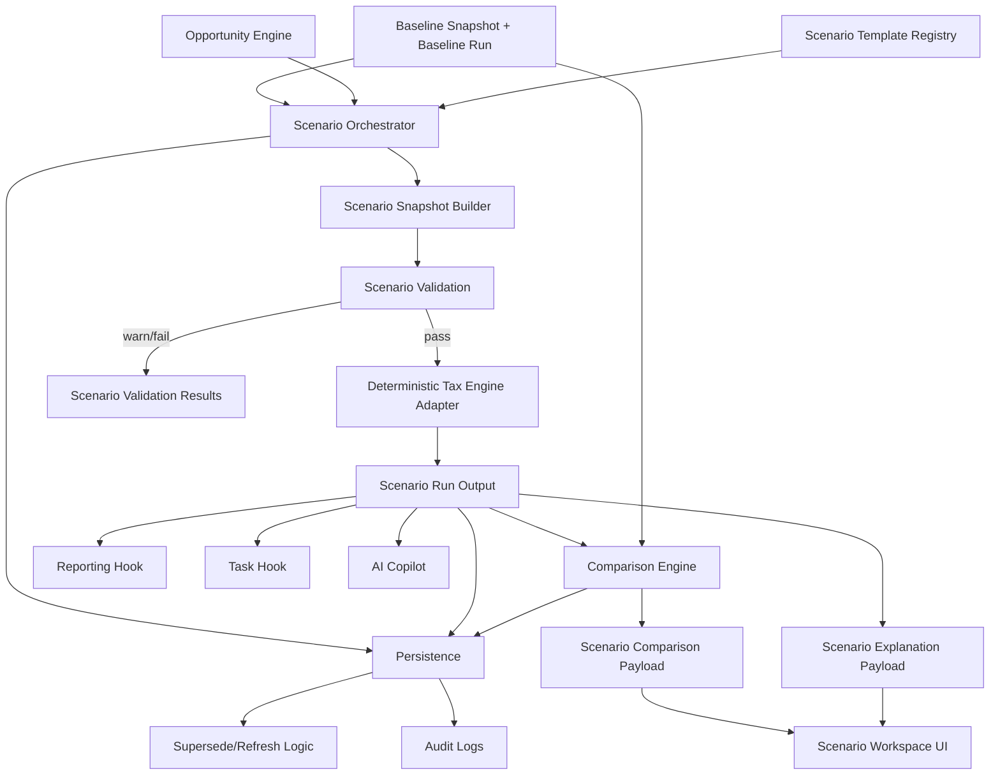
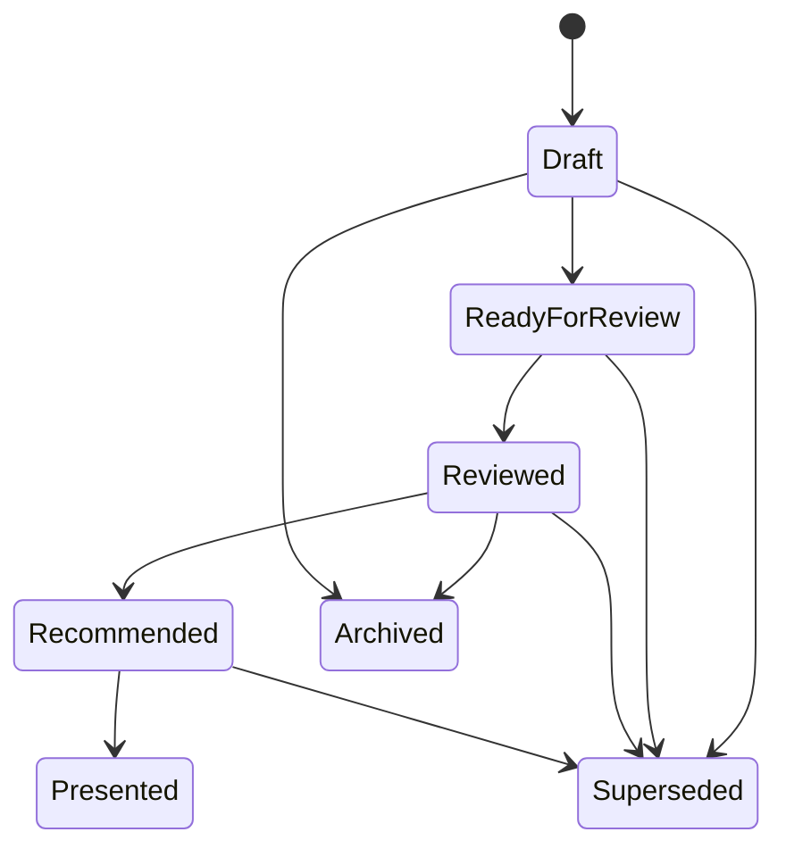

# Phase 5 Technical Build Pack — Scenario Planning Workspace
## Advisor Tax Intelligence Platform
**Audience:** AI coding team, backend engineers, product engineers, platform architects, design systems team, QA engineers, analytics team, compliance reviewers  
**Goal:** Translate the Phase 5 PRD into an implementation-ready technical build pack so the team can build a connected, auditable, scalable Scenario Planning Workspace on top of the deterministic tax engine and opportunity detection layer.

---

# 1) Build Pack Purpose

This document turns the Scenario Planning Workspace PRD into a technical implementation specification.

Its purpose is to prevent the most common failure modes:
- scenario logic bypassing the deterministic tax engine
- scenario state mutating baseline truth
- multiple services building their own comparison logic
- scenario assumptions being implicit instead of explicit
- stale scenarios remaining current after upstream facts change
- weak lineage between opportunities, scenarios, comparisons, and reports
- advisors losing track of which scenario is recommended
- no auditability around who changed what and when

This build pack assumes:
- Phase 2 provides approved facts and the household fact layer
- Phase 3 provides deterministic baseline/scenario calculation capability
- Phase 4 provides surfaced opportunities and scenario template hooks
- Phase 5 is responsible for orchestrating scenario creation, persistence, comparison, recommendation state, and downstream connectivity

---

# 2) Product Boundary

## Phase 5 owns
- scenario object model
- scenario creation and update flows
- template-driven scenario creation
- baseline clone orchestration
- scenario override persistence
- scenario assumption persistence
- scenario calculation orchestration
- comparison payload generation
- recommendation designation
- scenario lifecycle state machine
- scenario notes and metadata
- scenario supersede logic
- hooks to reporting/task/AI layers
- scenario events and audit trail

## Phase 5 does not own
- OCR/fact extraction
- deterministic tax calculation formulas
- opportunity detection logic
- final report rendering
- workflow/task engine implementation
- CPA or client portal
- state tax engine in V1

---

# 3) System Overview

The Scenario Planning Workspace should be built as a connected set of services and libraries.

## Core domains
1. **Scenario API Service**
2. **Scenario Orchestrator**
3. **Scenario Template Registry**
4. **Scenario Snapshot Builder**
5. **Scenario Validation Layer**
6. **Scenario Calculation Adapter**
7. **Comparison Engine**
8. **Recommendation State Service**
9. **Scenario Persistence / Audit Layer**
10. **Downstream Hook Service**
11. **Supersede / Refresh Engine**
12. **Event Emission Layer**

---

# 4) High-Level Architecture



---

# 5) Recommended Repository / Codebase Layout

```text
tax-platform/
  services/
    scenario-workspace-api/
      src/
        controllers/
        handlers/
        routes/
        auth/
    scenario-workspace-worker/
      src/
        jobs/
        orchestrators/
        emitters/
        validators/
    scenario-template-registry/
      packages/
        core/
        firm-overrides/
      tooling/
        validators/
        changelog/
    comparison-service/
      src/
        comparators/
        presenters/
  libs/
    domain-models/
      scenario/
      scenario-override/
      scenario-assumption/
      scenario-note/
      scenario-comparison/
      scenario-events/
      scenario-template/
      scenario-recommendation/
    orchestrators/
      scenario-create/
      scenario-update/
      scenario-refresh/
    mappers/
      opportunity-to-scenario-seed/
      scenario-to-report-request/
      scenario-to-task-request/
      scenario-to-ai-context/
    comparison/
      diff-builder/
      summary-card-builder/
      interpretation-builder/
    validation/
      scenario-validation/
    audit-utils/
    shared-types/
  infra/
    db/
      migrations/
      ddl/
    queues/
    events/
    observability/
  tests/
    unit/
    integration/
    golden/
    regression/
    comparison/
    lifecycle/
  docs/
    api/
    events/
    templates/
    runbooks/
```

### Implementation rule
All comparison logic must live in shared libraries or services, not inside frontend code or controller code.

---

# 6) Canonical Domain Contracts

## 6.1 PlanningScenario
```ts
export interface PlanningScenario {
  scenarioId: string;
  householdId: string;
  taxYear: number;
  baselineSnapshotId: string;
  baselineRunId: string;
  scenarioSnapshotId: string;
  scenarioRunId: string;
  scenarioType:
    | 'roth_conversion'
    | 'charitable'
    | 'capital_gains'
    | 'payments'
    | 'retirement_income'
    | 'transition'
    | 'custom';
  title: string;
  description?: string | null;
  originatingOpportunityId?: string | null;
  overrides: ScenarioOverride[];
  assumptions: ScenarioAssumption[];
  warnings: string[];
  blockers: MissingInfoItem[];
  status:
    | 'draft'
    | 'ready_for_review'
    | 'reviewed'
    | 'recommended'
    | 'presented'
    | 'archived'
    | 'superseded';
  recommended: boolean;
  version: number;
  createdBy: string;
  createdAt: string;
  updatedAt: string;
}
```

## 6.2 ScenarioOverride
```ts
export interface ScenarioOverride {
  overrideId: string;
  field: string;
  operator: 'replace' | 'add' | 'subtract' | 'toggle';
  value: number | string | boolean | null;
  reason: string;
  sourceType: 'manual' | 'template' | 'opportunity_seed';
  createdBy: string;
  createdAt: string;
}
```

## 6.3 ScenarioAssumption
```ts
export interface ScenarioAssumption {
  assumptionId: string;
  label: string;
  description?: string | null;
  value: number | string | boolean | null;
  units?: string | null;
  confidence?: 'high' | 'medium' | 'low';
}
```

## 6.4 MissingInfoItem
```ts
export interface MissingInfoItem {
  field: string;
  message: string;
  severity: 'info' | 'warning' | 'blocking';
}
```

## 6.5 ScenarioNote
```ts
export interface ScenarioNote {
  noteId: string;
  scenarioId: string;
  noteType: 'advisor_internal' | 'meeting_prep' | 'assumption' | 'compliance';
  body: string;
  createdBy: string;
  createdAt: string;
}
```

## 6.6 ScenarioTemplate
```ts
export interface ScenarioTemplate {
  scenarioTemplateId: string;
  name: string;
  scenarioType: PlanningScenario['scenarioType'];
  description: string;
  requiredFields: string[];
  seedOverrides: Partial<ScenarioOverride>[];
  seedAssumptions: Partial<ScenarioAssumption>[];
  linkedOpportunityTypes: string[];
  enabled: boolean;
  version: string;
}
```

## 6.7 ScenarioRecommendationState
```ts
export interface ScenarioRecommendationState {
  scenarioId: string;
  householdId: string;
  taxYear: number;
  isRecommended: boolean;
  setBy: string;
  setAt: string;
  reason?: string | null;
}
```

## 6.8 ScenarioSnapshot
This is a scenario-specific input payload sent to the deterministic tax engine.

```ts
export interface ScenarioSnapshot {
  scenarioSnapshotId: string;
  householdId: string;
  taxYear: number;
  basedOnSnapshotId: string;
  scenarioId: string;
  overrideSignature: string;
  inputs: Record<string, number | string | boolean | null>;
  assumptions: ScenarioAssumption[];
  warnings: string[];
  blockers: MissingInfoItem[];
  createdAt: string;
}
```

## 6.9 ScenarioComparisonView
```ts
export interface ScenarioComparisonView {
  comparisonId: string;
  householdId: string;
  taxYear: number;
  baselineRunId: string;
  comparisonRunIds: string[];
  summaryCards: ComparisonSummaryCard[];
  rowComparisons: ComparisonRow[];
  interpretationNotes: string[];
  warnings: string[];
}
```

## 6.10 ComparisonSummaryCard
```ts
export interface ComparisonSummaryCard {
  label: string;
  baselineValue: number | string | null;
  comparisonValues: Array<{
    runId: string;
    value: number | string | null;
    delta: number | null;
  }>;
}
```

## 6.11 ComparisonRow
```ts
export interface ComparisonRow {
  field: string;
  label: string;
  baselineValue: number | string | null;
  comparisonValues: Array<{
    runId: string;
    value: number | string | null;
    delta: number | null;
  }>;
  significance: 'high' | 'medium' | 'low';
}
```

## 6.12 ScenarioCreateCommand
```ts
export interface ScenarioCreateCommand {
  householdId: string;
  taxYear: number;
  baselineSnapshotId: string;
  baselineRunId: string;
  scenarioType: PlanningScenario['scenarioType'];
  originatingOpportunityId?: string | null;
  title?: string;
  description?: string | null;
  overrides: Omit<ScenarioOverride, 'overrideId' | 'createdAt'>[];
  assumptions?: Omit<ScenarioAssumption, 'assumptionId'>[];
  requestedBy: string;
}
```

## 6.13 ScenarioUpdateCommand
```ts
export interface ScenarioUpdateCommand {
  scenarioId: string;
  title?: string;
  description?: string | null;
  overrides?: Omit<ScenarioOverride, 'createdAt'>[];
  assumptions?: Omit<ScenarioAssumption, 'assumptionId'>[];
  status?: PlanningScenario['status'];
  requestedBy: string;
}
```

## 6.14 ScenarioCalculationResult
```ts
export interface ScenarioCalculationResult {
  scenarioId: string;
  scenarioRunId: string;
  scenarioSnapshotId: string;
  warnings: string[];
  blockers: MissingInfoItem[];
  explanationPayload: Record<string, unknown>;
}
```

---

# 7) Required Input Mapping Layer

This layer builds scenario seed inputs from baseline runs and opportunities.

## 7.1 Purpose
Ensure consistent scenario creation regardless of whether the scenario was created:
- manually
- from an opportunity
- from a template
- by duplicating an existing scenario

## 7.2 Opportunity-to-scenario seed contract
```ts
export interface OpportunityScenarioSeed {
  householdId: string;
  taxYear: number;
  baselineSnapshotId: string;
  baselineRunId: string;
  scenarioType: PlanningScenario['scenarioType'];
  title?: string;
  description?: string | null;
  seedOverrides: Partial<ScenarioOverride>[];
  seedAssumptions: Partial<ScenarioAssumption>[];
  warnings: string[];
}
```

## 7.3 Mapping rules
- seed logic must live in a central mapper
- opportunity metadata can propose defaults but cannot create computed outputs directly
- templates and opportunity seeds should be merged predictably with explicit precedence
- manual user edits always win over seeded defaults

### Precedence order
1. manual user edits
2. template seeds
3. opportunity seeds
4. baseline defaults

---

# 8) Scenario Template Registry Spec

## 8.1 Purpose
Provide a versioned, testable registry of scenario templates used by opportunity hooks and manual scenario creation.

## 8.2 Template package contract
```ts
export interface ScenarioTemplatePackage {
  packageVersion: string;
  status: 'draft' | 'published' | 'deprecated';
  publishedAt?: string;
  metadata: {
    description: string;
    changeLog: string[];
    authoredBy: string;
  };
  templates: ScenarioTemplate[];
}
```

## 8.3 Registry service requirements
- retrieve template by ID and version
- retrieve current published templates
- enable firm-level overrides later
- validate templates before publish
- block edits to published versions
- attach regression test coverage to publish event

## 8.4 Required V1 templates
- Roth fill scenario
- charitable bunching scenario
- QCD scenario
- gain harvesting threshold scenario
- withholding adjustment scenario
- retirement-year wage reduction scenario

---

# 9) Scenario Orchestrator Spec

## 9.1 Purpose
Coordinate scenario lifecycle from creation through calculation, comparison, persistence, and event emission.

## 9.2 Creation flow
1. validate baseline snapshot/run exist
2. build initial scenario object
3. build scenario snapshot from baseline + overrides + assumptions
4. validate scenario snapshot
5. send scenario snapshot to deterministic tax engine adapter
6. receive scenario run result
7. build comparison payload versus baseline
8. persist scenario, comparison, notes, and audit data
9. emit `scenario.created` and `scenario.calculated`

## 9.3 Update flow
1. load current scenario version
2. apply updates
3. create new scenario version if material changes occurred
4. rebuild scenario snapshot
5. rerun deterministic engine
6. rebuild comparison payload
7. persist
8. emit update events

## 9.4 Duplicate flow
1. load source scenario
2. clone scenario metadata
3. copy overrides and assumptions
4. assign new ID and version = 1
5. rerun calculation
6. persist and emit created event

---

# 10) Scenario Snapshot Builder Spec

## 10.1 Purpose
Create a stable scenario-specific input payload by applying scenario overrides to the baseline snapshot.

## 10.2 Builder invariants
- baseline snapshot remains immutable
- scenario snapshot must record `basedOnSnapshotId`
- scenario snapshot must have deterministic `overrideSignature`
- all scenario overrides must be explicit and serializable
- assumptions should not masquerade as extracted facts

## 10.3 Example scenario snapshot
```json
{
  "scenarioSnapshotId": "ss_001",
  "householdId": "hh_123",
  "taxYear": 2025,
  "basedOnSnapshotId": "tis_001",
  "scenarioId": "scn_001",
  "overrideSignature": "abc123",
  "inputs": {
    "iraDistributionsTaxable": 120000,
    "federalWithholding": 44000
  },
  "assumptions": [
    {
      "assumptionId": "asm_001",
      "label": "Roth conversion amount",
      "value": 50000,
      "units": "USD",
      "confidence": "high"
    }
  ],
  "warnings": [],
  "blockers": []
}
```

---

# 11) Scenario Validation Spec

## 11.1 Purpose
Prevent impossible, unsupported, or unsafe scenario structures from proceeding silently.

## 11.2 Validation stages
1. schema validation
2. override field validation
3. override type validation
4. cross-field consistency validation
5. supportability validation
6. blocker generation

## 11.3 Example validations
- override field must exist in allowed scenario input set
- numeric add/subtract overrides only allowed on numeric fields
- boolean toggle only allowed on boolean fields
- replacement values cannot violate basic consistency rules
- scenarios that rely on unsupported complexity should be flagged
- negative values blocked where inappropriate

## 11.4 Validation result contract
```ts
export interface ScenarioValidationResult {
  scenarioId: string;
  status: 'pass' | 'pass_with_warning' | 'soft_fail_requires_review' | 'hard_fail_block_run';
  warnings: string[];
  blockers: MissingInfoItem[];
}
```

---

# 12) Deterministic Tax Engine Adapter

## 12.1 Purpose
Create a stable integration layer between Phase 5 and Phase 3 so scenario runs are calculated identically to baseline logic.

## 12.2 Adapter contract
```ts
export interface ScenarioCalculationAdapter {
  runScenario(snapshot: ScenarioSnapshot, requestedBy: string): Promise<ScenarioCalculationResult>;
}
```

## 12.3 Adapter requirements
- must call deterministic tax engine, never duplicate logic
- must store resulting scenario run ID
- must retrieve explanation payload
- must preserve warnings from tax engine
- must propagate unsupported item flags into scenario warnings or blockers

---

# 13) Comparison Engine Spec

## 13.1 Purpose
Build reusable comparison payloads across:
- baseline vs one scenario
- baseline vs multiple scenarios
- scenario vs scenario

## 13.2 Engine inputs
- baseline run summary
- scenario run summaries
- diff objects from Phase 3
- explanation payloads
- warning sets

## 13.3 Required outputs
- summary cards
- row comparison list
- significance mapping
- interpretation notes
- warning rollup

## 13.4 Interpretation builder rules
Interpretation notes should be deterministic templates based on diff outputs, not freeform AI.

### Example templates
- "This scenario increases taxable income by ${delta}."
- "This scenario changes deduction method from ${from} to ${to}."
- "This scenario reduces the projected balance due by ${delta}."
- "This scenario introduces new warning(s) related to threshold proximity."

## 13.5 Significance mapping
Fields should be tagged high/medium/low significance so UI can emphasize what matters most.

### Suggested default significance
High:
- totalTax
- taxableIncome
- agi
- refundOrBalanceDue
- deductionMethod
- niit

Medium:
- paymentsTotal
- ordinaryIncomeTax
- preferentialIncomeTax
- threshold metrics

Low:
- less material supporting lines unless configured

---

# 14) Recommendation State Service

## 14.1 Purpose
Manage which scenario is recommended for a household planning set.

## 14.2 Rules
- only one recommended scenario per household/taxYear/planning set by default
- setting a new recommended scenario unsets prior recommendation
- history of recommendation changes must be preserved
- recommended scenario must be tied to user attribution and timestamp
- optionally require note/reason on recommend action

## 14.3 Service contract
```ts
export interface ScenarioRecommendationService {
  setRecommendedScenario(
    scenarioId: string,
    householdId: string,
    taxYear: number,
    setBy: string,
    reason?: string
  ): Promise<ScenarioRecommendationState>;
}
```

---

# 15) Scenario Lifecycle State Machine



## 15.1 Transition rules
- material edits should return scenario to `draft` or `ready_for_review` depending on policy
- `recommended` can only be set on a valid calculated scenario
- `presented` implies a scenario was used in a client-facing context later
- `superseded` scenarios are read-only except audit fields

---

# 16) Notes and Collaboration Spec

## 16.1 Purpose
Preserve advisor reasoning and planning context.

## 16.2 Requirements
- multiple notes per scenario
- note types separated
- immutable creation timestamps
- optional edit history if notes are editable
- notes should be accessible to report generation and AI layers with permission controls

## 16.3 Recommended note types
- advisor_internal
- meeting_prep
- assumption
- compliance

---

# 17) Downstream Hook Services

## 17.1 Report Hook
Create a structured report request payload from scenario objects.

```ts
export interface ScenarioReportRequest {
  scenarioId: string;
  householdId: string;
  taxYear: number;
  scenarioRunId: string;
  comparisonId?: string;
  requestType:
    | 'client_summary'
    | 'advisor_memo'
    | 'comparison_report'
    | 'executive_summary';
}
```

## 17.2 Task Hook
Create structured task request payloads from scenarios.

```ts
export interface ScenarioTaskRequest {
  scenarioId: string;
  householdId: string;
  taskType:
    | 'follow_up'
    | 'prepare_meeting'
    | 'coordinate_cpa'
    | 'request_data'
    | 'implementation';
  title: string;
  description: string;
  priority: 'low' | 'medium' | 'high';
}
```

## 17.3 AI Context Hook
Create structured AI-safe scenario context payloads.

```ts
export interface ScenarioAIContext {
  scenarioId: string;
  householdId: string;
  scenarioType: PlanningScenario['scenarioType'];
  summary: Record<string, unknown>;
  comparisonView: ScenarioComparisonView;
  notes: ScenarioNote[];
  warnings: string[];
  blockers: MissingInfoItem[];
}
```

---

# 18) API Surface

## 18.1 Create scenario
`POST /scenarios`

### Request
```json
{
  "householdId": "hh_123",
  "taxYear": 2025,
  "baselineSnapshotId": "tis_001",
  "baselineRunId": "calc_001",
  "scenarioType": "roth_conversion",
  "originatingOpportunityId": "opp_001",
  "title": "Roth Conversion — $50K",
  "overrides": [
    {
      "field": "iraDistributionsTaxable",
      "operator": "add",
      "value": 50000,
      "reason": "Model Roth conversion amount",
      "sourceType": "opportunity_seed",
      "createdBy": "user_1"
    }
  ],
  "requestedBy": "user_1"
}
```

## 18.2 Update scenario
`PATCH /scenarios/{scenarioId}`

## 18.3 Get scenario detail
`GET /scenarios/{scenarioId}`

## 18.4 List scenarios by household
`GET /households/{householdId}/scenarios?taxYear=2025`

## 18.5 Create scenario from template
`POST /scenario-templates/{scenarioTemplateId}/create`

## 18.6 Duplicate scenario
`POST /scenarios/{scenarioId}/duplicate`

## 18.7 Compare scenarios
`POST /scenario-comparisons`

## 18.8 Set recommended scenario
`POST /scenarios/{scenarioId}/recommend`

## 18.9 Archive scenario
`POST /scenarios/{scenarioId}/archive`

## 18.10 Add note
`POST /scenarios/{scenarioId}/notes`

---

# 19) Event Model

## 19.1 Events to emit
- `scenario.created`
- `scenario.updated`
- `scenario.calculated`
- `scenario.validation_failed`
- `scenario.recommended`
- `scenario.archived`
- `scenario.superseded`
- `scenario.duplicated`
- `scenario.note_added`
- `scenario.converted_to_report_request`
- `scenario.converted_to_task_request`

## 19.2 Sample event payloads

### `scenario.created`
```json
{
  "eventName": "scenario.created",
  "scenarioId": "scn_001",
  "householdId": "hh_123",
  "taxYear": 2025,
  "scenarioType": "roth_conversion",
  "originatingOpportunityId": "opp_001",
  "createdAt": "2026-03-30T22:00:00Z"
}
```

### `scenario.calculated`
```json
{
  "eventName": "scenario.calculated",
  "scenarioId": "scn_001",
  "householdId": "hh_123",
  "scenarioRunId": "calc_002",
  "comparisonId": "cmp_001",
  "warnings": [],
  "occurredAt": "2026-03-30T22:00:02Z"
}
```

### `scenario.recommended`
```json
{
  "eventName": "scenario.recommended",
  "scenarioId": "scn_001",
  "householdId": "hh_123",
  "taxYear": 2025,
  "setBy": "user_1",
  "setAt": "2026-03-30T22:10:00Z"
}
```

### `scenario.superseded`
```json
{
  "eventName": "scenario.superseded",
  "scenarioId": "scn_001",
  "householdId": "hh_123",
  "reason": "Baseline run superseded",
  "occurredAt": "2026-03-30T23:00:00Z"
}
```

## 19.3 Event consumers
- reporting engine
- workflow/task engine
- AI copilot
- analytics service
- compliance monitoring

---

# 20) Database DDL Guidance

## 20.1 `scenarios`
```sql
CREATE TABLE scenarios (
  scenario_id UUID PRIMARY KEY,
  household_id UUID NOT NULL,
  tax_year INT NOT NULL,
  baseline_snapshot_id UUID NOT NULL,
  baseline_run_id UUID NOT NULL,
  scenario_snapshot_id UUID NOT NULL,
  scenario_run_id UUID NOT NULL,
  scenario_type TEXT NOT NULL,
  title TEXT NOT NULL,
  description TEXT NULL,
  originating_opportunity_id UUID NULL,
  status VARCHAR(30) NOT NULL,
  recommended BOOLEAN NOT NULL DEFAULT FALSE,
  version INT NOT NULL DEFAULT 1,
  created_by UUID NOT NULL,
  created_at TIMESTAMPTZ NOT NULL DEFAULT NOW(),
  updated_at TIMESTAMPTZ NOT NULL DEFAULT NOW()
);
CREATE INDEX idx_scenarios_household_year ON scenarios (household_id, tax_year);
CREATE INDEX idx_scenarios_recommended ON scenarios (household_id, tax_year, recommended);
```

## 20.2 `scenario_overrides`
```sql
CREATE TABLE scenario_overrides (
  override_id UUID PRIMARY KEY,
  scenario_id UUID NOT NULL REFERENCES scenarios(scenario_id),
  override_json JSONB NOT NULL,
  created_at TIMESTAMPTZ NOT NULL DEFAULT NOW()
);
CREATE INDEX idx_scenario_overrides_scenario_id ON scenario_overrides (scenario_id);
```

## 20.3 `scenario_assumptions`
```sql
CREATE TABLE scenario_assumptions (
  assumption_id UUID PRIMARY KEY,
  scenario_id UUID NOT NULL REFERENCES scenarios(scenario_id),
  assumption_json JSONB NOT NULL,
  created_at TIMESTAMPTZ NOT NULL DEFAULT NOW()
);
CREATE INDEX idx_scenario_assumptions_scenario_id ON scenario_assumptions (scenario_id);
```

## 20.4 `scenario_notes`
```sql
CREATE TABLE scenario_notes (
  note_id UUID PRIMARY KEY,
  scenario_id UUID NOT NULL REFERENCES scenarios(scenario_id),
  note_type TEXT NOT NULL,
  body TEXT NOT NULL,
  created_by UUID NOT NULL,
  created_at TIMESTAMPTZ NOT NULL DEFAULT NOW()
);
CREATE INDEX idx_scenario_notes_scenario_id ON scenario_notes (scenario_id);
```

## 20.5 `scenario_comparisons`
```sql
CREATE TABLE scenario_comparisons (
  comparison_id UUID PRIMARY KEY,
  household_id UUID NOT NULL,
  tax_year INT NOT NULL,
  baseline_run_id UUID NOT NULL,
  comparison_run_ids_json JSONB NOT NULL,
  comparison_payload_json JSONB NOT NULL,
  created_at TIMESTAMPTZ NOT NULL DEFAULT NOW()
);
CREATE INDEX idx_scenario_comparisons_household_year ON scenario_comparisons (household_id, tax_year);
```

## 20.6 `scenario_recommendation_history`
```sql
CREATE TABLE scenario_recommendation_history (
  event_id UUID PRIMARY KEY,
  scenario_id UUID NOT NULL REFERENCES scenarios(scenario_id),
  household_id UUID NOT NULL,
  tax_year INT NOT NULL,
  is_recommended BOOLEAN NOT NULL,
  set_by UUID NOT NULL,
  reason TEXT NULL,
  created_at TIMESTAMPTZ NOT NULL DEFAULT NOW()
);
CREATE INDEX idx_scenario_recommendation_history_household_year ON scenario_recommendation_history (household_id, tax_year, created_at DESC);
```

## 20.7 `scenario_templates`
```sql
CREATE TABLE scenario_templates (
  scenario_template_id TEXT PRIMARY KEY,
  name TEXT NOT NULL,
  scenario_type TEXT NOT NULL,
  template_json JSONB NOT NULL,
  enabled BOOLEAN NOT NULL DEFAULT TRUE,
  version TEXT NOT NULL,
  created_at TIMESTAMPTZ NOT NULL DEFAULT NOW(),
  updated_at TIMESTAMPTZ NOT NULL DEFAULT NOW()
);
```

## 20.8 `scenario_audit_events`
```sql
CREATE TABLE scenario_audit_events (
  event_id UUID PRIMARY KEY,
  scenario_id UUID NOT NULL REFERENCES scenarios(scenario_id),
  actor UUID NULL,
  action TEXT NOT NULL,
  before_json JSONB NULL,
  after_json JSONB NULL,
  created_at TIMESTAMPTZ NOT NULL DEFAULT NOW()
);
CREATE INDEX idx_scenario_audit_scenario_id_created_at ON scenario_audit_events (scenario_id, created_at DESC);
```

---

# 21) Comparison Payload Example

```json
{
  "comparisonId": "cmp_001",
  "householdId": "hh_123",
  "taxYear": 2025,
  "baselineRunId": "calc_001",
  "comparisonRunIds": ["calc_002", "calc_003"],
  "summaryCards": [
    {
      "label": "Total Tax",
      "baselineValue": 99550,
      "comparisonValues": [
        { "runId": "calc_002", "value": 111550, "delta": 12000 },
        { "runId": "calc_003", "value": 104200, "delta": 4650 }
      ]
    },
    {
      "label": "Taxable Income",
      "baselineValue": 462200,
      "comparisonValues": [
        { "runId": "calc_002", "value": 512200, "delta": 50000 },
        { "runId": "calc_003", "value": 480000, "delta": 17800 }
      ]
    }
  ],
  "rowComparisons": [
    {
      "field": "deductionMethod",
      "label": "Deduction Method",
      "baselineValue": "itemized",
      "comparisonValues": [
        { "runId": "calc_002", "value": "itemized", "delta": null },
        { "runId": "calc_003", "value": "standard", "delta": null }
      ],
      "significance": "high"
    }
  ],
  "interpretationNotes": [
    "This scenario increases taxable income by 50,000.",
    "This scenario changes deduction method from itemized to standard."
  ],
  "warnings": []
}
```

---

# 22) Supersede / Refresh Logic

## 22.1 Trigger sources
- approved fact updated
- baseline run superseded
- source opportunity superseded
- deterministic engine version changed materially
- tax rules package updated materially

## 22.2 Flow
1. receive source event
2. identify scenarios depending on the affected baseline or fact signature
3. mark scenarios `superseded` or `refresh_required` in UI-friendly status metadata
4. emit `scenario.superseded`
5. optionally queue refresh/rebuild if policy allows
6. preserve prior scenario and comparison for audit

## 22.3 Required invariants
- historical scenarios are never overwritten
- refreshed scenarios get new version or new scenario ID according to policy
- recommendation state should be cleared or flagged if superseded
- comparison outputs must not silently update in place

---

# 23) AI Integration Rules

## 23.1 What AI may consume
- scenario objects
- scenario comparison payloads
- scenario notes
- warnings and blockers
- explanation payloads from deterministic engine

## 23.2 What AI may do
- suggest titles/summaries
- draft client-friendly explanations
- draft advisor meeting notes
- summarize tradeoffs

## 23.3 What AI may not do
- compute scenario outputs independently
- change overrides silently
- suppress warnings/blockers
- mark scenarios recommended
- mutate recommendation state

## 23.4 Design rule
AI interprets.
Deterministic engine calculates.
Advisor decides.

---

# 24) QA and Golden Test Pack

## 24.1 Unit tests
- scenario snapshot builder
- override precedence
- template seed merge
- recommendation state setter
- lifecycle transitions

## 24.2 Integration tests
- create scenario from baseline
- create scenario from opportunity
- create scenario from template
- duplicate scenario
- deterministic engine adapter flow
- comparison payload generation
- note creation
- recommended scenario switching
- supersede flow

## 24.3 Golden datasets
Create benchmark scenario sets for:
- Roth conversion household
- charitable bunching household
- QCD household
- gain harvesting household
- withholding adjustment household
- retirement-year wage reduction household
- incomplete-data scenario household

Each dataset should include expected:
- scenario outputs
- row comparison deltas
- warnings/blockers
- lifecycle behavior
- recommendation behavior

## 24.4 Regression tests
- same overrides + same baseline = same scenario output
- baseline remains unchanged after many scenario runs
- recommendation switch preserves history
- superseded scenarios stay read-only
- comparison engine output stable across UI consumers

---

# 25) Observability Spec

## 25.1 Metrics
- `scenario_create_latency_ms`
- `scenario_calculation_latency_ms`
- `scenario_validation_failure_count`
- `scenario_recommend_count`
- `scenario_supersede_count`
- `comparison_generation_latency_ms`
- `average_scenarios_per_household`
- `template_usage_rate`

## 25.2 Logs
Structured logs for:
- scenario create/update requests
- template load
- scenario snapshot build
- validation failure
- deterministic engine adapter response
- comparison generation
- recommendation state changes
- supersede events

## 25.3 Alerts
Alert when:
- scenario calculation failure rate spikes
- comparison generation fails
- recommendation state writes fail
- template registry lookup failures occur
- supersede events stop propagating

---

# 26) Security / Compliance Requirements

- role-based access to scenarios, notes, and comparison payloads
- immutable audit trail for scenario lifecycle changes
- version stamp scenario outputs, comparison payloads, and downstream requests
- preserve recommendation history
- ability to reconstruct exactly what scenario and comparison the advisor used at a point in time

## Reconstruction requirement
Firm must be able to reconstruct:
- baseline snapshot/run
- overrides
- assumptions
- scenario snapshot
- scenario run output
- comparison payload
- notes present at the time
- who marked the scenario recommended

---

# 27) Delivery Milestones

## Milestone 1 — Domain contracts and template registry
- schemas frozen
- template contract frozen
- create/update API draft frozen

## Milestone 2 — Scenario create/update pipeline
- baseline clone orchestration live
- scenario snapshot builder live
- persistence live

## Milestone 3 — Calculation and comparison
- deterministic adapter live
- comparison engine live
- summary cards live

## Milestone 4 — Recommendation and notes
- recommendation service live
- note system live
- lifecycle state transitions live

## Milestone 5 — Supersede and downstream hooks
- supersede logic live
- report/task/AI hooks live
- analytics events live

## Milestone 6 — Pilot readiness
- golden scenarios passing
- dashboards live
- runbooks complete

---

# 28) Runbooks the Team Should Create

- how to add a new scenario template
- how to debug a failed scenario calculation
- how to reconstruct a recommended scenario for audit
- how to diagnose stale/superseded scenarios
- how to compare scenario outputs before/after engine release
- how to respond to comparison payload inconsistencies

---

# 29) Final Build Standards

1. **No scenario without deterministic calculation**
2. **No mutation of baseline**
3. **No implicit assumptions**
4. **No comparison logic duplicated in clients**
5. **No silent recommendation changes**
6. **No stale scenario left appearing current**
7. **No report/task payload built without scenario version metadata**
8. **No AI-written outputs treated as authoritative math**

---

# 30) Final Instruction to Builders

Treat the Scenario Planning Workspace as the advisor’s decision surface.

This is not a spreadsheet clone.
It is a **planning decision platform** built on deterministic tax logic.

The system must do five things well:
- let advisors create planning scenarios fast
- preserve exactly what changed
- compare options clearly
- support a recommended path
- keep the whole process auditable and reusable downstream

When this build pack is implemented correctly, advisors can move from “interesting opportunity” to “recommended plan” inside the product.

That is the standard.
